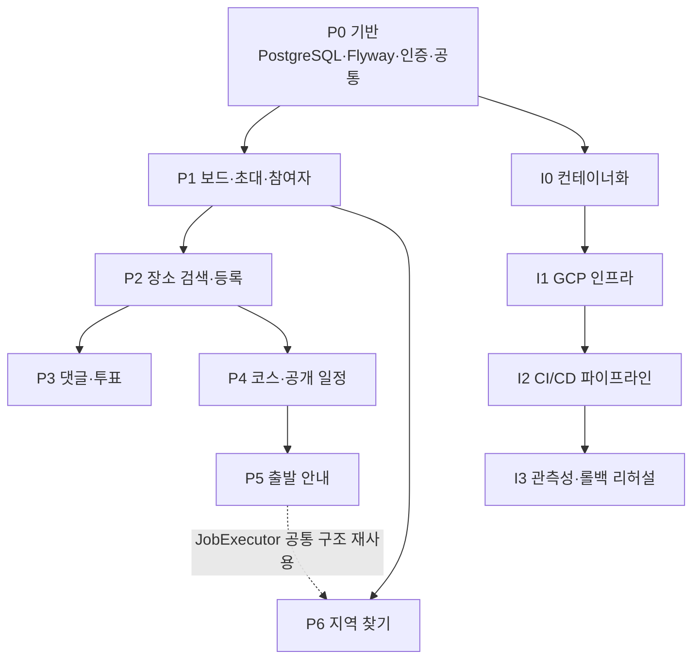

# 백엔드 구현 마스터 플랜 (INDEX)

| 항목 | 내용 |
|---|---|
| 문서 버전 | 1.0 |
| 작성일 | 2026-07-22 |
| 대상 | `backend` repository (Kotlin + Spring Boot 단일 프로세스) |
| 기준 문서 | `../../../docs/specs/기능명세서_v1.3.md`, `API명세서_v1.1.md`, `ERD_v1.0.md`, `시스템아키텍처_v1.0.md` |
| 범위 | **백엔드 한정.** 프론트엔드는 별도 에이전트가 동시 진행 |

> 규칙: 스펙 문서가 진실의 원본이다. 구현 중 문서와 어긋나는 부분을 발견하면 **구현으로 덮어쓰지 말고 먼저 보고**한다. (AGENTS.md)

---

## 1. 문서 구조

계획이 커서 단계별 문서로 분할했다. 각 단계 문서는 그 단계 안에서만 완결된 작업 단위·검증 기준·산출물을 가진다.

| 문서 | 단계 | 한 줄 요약 |
|---|---|---|
| [`01-phase0-foundation.md`](01-phase0-foundation.md) | P0 | PostgreSQL·Flyway·인증 필터·공통 규약 등 **모든 기능의 토대** |
| [`02-phase1-board-participant.md`](02-phase1-board-participant.md) | P1 | 보드·초대·참여자 (엔드포인트 1~8) |
| [`03-phase2-place-search.md`](03-phase2-place-search.md) | P2 | Kakao Local 어댑터·장소 등록/조회 (9~15) |
| [`04-phase3-comment-vote.md`](04-phase3-comment-vote.md) | P3 | 댓글·투표 (16~24) |
| [`05-phase4-course-public.md`](05-phase4-course-public.md) | P4 | 코스 초안·확정 코스·공개 일정 (27~31, 34) |
| [`06-phase5-departure.md`](06-phase5-departure.md) | P5 | 출발지·TMAP·Job Executor·개인 출발 안내 (32~33) |
| [`07-phase6-area-search.md`](07-phase6-area-search.md) | P6 | ODsay·JTS·지역 찾기 비동기 작업 (25~26) |
| [`08-infra-cicd-gcp.md`](08-infra-cicd-gcp.md) | I0~I3 | Docker·GCP 인프라·GitHub Actions CI/CD·관측성·롤백 |
| [`09-verification-policy.md`](09-verification-policy.md) | — | 전 단계 공통 검증 기준·게이트·테스트 레이어 정의 |
| [`10-fe-contract-sync.md`](10-fe-contract-sync.md) | — | FE 에이전트와의 계약 동기화 절차 (병렬 작업 충돌 방지) |

---

## 2. 현재 상태 (2026-07-22 기준 실측)

`backend/src` 확인 결과 구현된 것은 다음뿐이다. 나머지는 **전부 없다고 가정하고 시작**한다.

- `TeamdApplication.kt`, `application.yml`
- `global/error/` — `ErrorCode`, `ErrorResponse`, `BusinessException`, `GlobalExceptionHandler`(+테스트)
- `global/web/RequestIdFilter.kt`, `global/config/WebConfig.kt`
- 빌드: Kotlin 2.3.21 / Spring Boot 4.1.0 / Java 21 / **H2 (교체 대상)** / springdoc
- 없음: PostgreSQL 드라이버, Flyway, Spring Security, JTS, Micrometer/OTel, 도메인 패키지 전체, Dockerfile, CI

---

## 3. 전체 의존 그래프



**핵심 선행 관계**

| 후행 | 선행 | 이유 |
|---|---|---|
| 모든 Pn | P0 | DB 스키마·인증 컨텍스트·오류 규약이 없으면 어떤 API도 완결되지 않는다 |
| P2 | P1 | 장소는 `board_id`·`proposer_id(participant)` FK를 필수로 가진다 |
| P3 | P2 | 댓글·투표 후보가 `place`를 참조한다 |
| P4 | P2 | `course_stop.place_id` FK, 초안 stops의 placeId 검증 |
| P5 | P4 | 출발 안내 목적지 = 확정 코스의 `FIRST_MEETING`. `course_id` FK 필요 |
| P5 | P1(출발지) | `participant.origin_ciphertext` 등록 필요 |
| P6 | P1(출발지) | 참여자 출발 좌표가 입력값 (snapshot에는 참여자 ID만 저장, 좌표는 실행 시 원본 복호화) |
| I1 | I0 | 이미지가 있어야 Artifact Registry·VM 배포 검증 가능 |

---

## 4. 병렬 실행 계획

한 명(또는 한 에이전트)만 있어도 순서대로 진행 가능하지만, 인원이 2~3이면 아래 레인으로 나눈다.
**같은 레인 안은 순차, 다른 레인은 동시 진행 가능.** 각 웨이브 시작 전에 선행 웨이브의 검증 게이트를 통과해야 한다.

### Wave 0 — 직렬 (병렬 불가)
P0 전체. 여기서 만든 `BaseEntity`·`PublicId`·인증 필터·Flyway 베이스라인을 모두가 공유하므로 **반드시 한 사람이 끝내고 머지**한다.

### Wave 1 (P0 완료 후)
| 레인 | 작업 | 비고 |
|---|---|---|
| A | P1 보드·초대·참여자 | Wave 2의 선행이라 최우선 |
| B | I0 컨테이너화 (Dockerfile, compose, `application-prod.yml` 골격) | 도메인 코드와 무관하게 진행 가능 |
| C | 외부 API 어댑터 **골격만** (Kakao/ODsay/TMAP client 인터페이스 + **`RestClient`** 설정 + 429 백오프 공통 로직) | 실제 사용은 P2/P5/P6. 계약만 먼저 고정. WebFlux 의존성을 추가하지 않는다 |

### Wave 2 (P1 완료 후)
| 레인 | 작업 |
|---|---|
| A | P2 장소 검색·등록 (레인 C의 Kakao 어댑터 사용) |
| B | I1 GCP 인프라 (프로젝트·VPC·Cloud SQL·VM·고정 IP·Artifact Registry·Secret Manager) |
| C | P6의 앞부분: JTS 폴리곤 유틸 + ODsay 도달권 어댑터 단위 테스트 (DB 연동 전) |

### Wave 3 (P2 완료 후)
| 레인 | 작업 |
|---|---|
| A | P3 댓글·투표 |
| B | P4 코스 초안·확정·공개 일정 |
| C | I2 CI/CD 파이프라인 |

> ⚠️ A와 B는 둘 다 장소 삭제 경로(`409 PLACE_IN_USE`)를 건드린다. **`PlaceUsageChecker` 인터페이스를 P2에서 미리 정의**하고, P3(투표 참조)·P4(코스 참조)가 각각 구현체를 등록하는 방식으로 파일 충돌을 없앤다.

### Wave 4 (P4 완료 후)
| 레인 | 작업 |
|---|---|
| A | P5 출발 안내 (Job Executor 기반 구조 확립 — **이 구조를 P6가 재사용**) |
| B | I3 관측성·배포/롤백 리허설 |

### Wave 5
P6 지역 찾기 마무리 (P5의 Job Executor·재시도·복구 로직 재사용). ODsay 고정 IP 등록(I1 산출물)이 선행되어야 운영 검증이 가능하다.

---

## 5. 단계별 완료 게이트 요약

각 단계는 **아래 4종을 모두 통과해야 다음 웨이브를 시작**한다. 상세는 [`09-verification-policy.md`](09-verification-policy.md).

1. `./gradlew build` 그린 (컴파일 + 전체 테스트)
2. 해당 단계의 **계약 테스트**(`@SpringBootTest` + MockMvc + Testcontainers PostgreSQL) 통과 — API 명세의 상태코드·오류코드 일치
3. 해당 단계의 **E2E 시나리오**(API명세서 16절 표) 통과
4. **보안 체크리스트** 통과 — 토큰·좌표·검색어가 로그/응답에 없음

---

## 6. 권장 진행 순서 (한 줄 요약)

```
P0 → P1 → P2 → (P3 ∥ P4 ∥ I2) → P5 → P6
       └ I0 → I1 (P1~P2와 병렬) ────────┘ → I3
```

---

## 7. 이 계획이 명시적으로 하지 않는 것

- 프론트엔드 구현 (별도 에이전트). 백엔드는 [`10-fe-contract-sync.md`](10-fe-contract-sync.md)의 계약 공개 의무만 진다.
- Redis / Kafka / 별도 워커 / Kubernetes / 다중 VM — 아키텍처 문서 14절에 따라 MVP 제외.
- 외부 API 결과 캐시 테이블·TTL 정책 — ERD 4절에 따라 도입하지 않는다.
- PlaceReaction, ActivityEvent, 알림, 운영 대시보드 — MVP 제외.

---

## 8. 리뷰 반영 결정 이력 (2026-07-22)

NO-GO 리뷰에서 지적된 blocker 6건을 아래와 같이 확정하고 스펙·계획 문서에 반영했다.

| # | 문제 | 결정 | 반영 위치 |
|---:|---|---|---|
| 1 | 초대 코드를 HMAC으로 저장하면 호스트 초대 화면(`GET /invitation`)을 구현할 수 없음 | **초대 코드·공개 토큰은 원문 저장**, 참여 토큰 secret만 HMAC 유지. 보호는 난수 엔트로피 + 만료 + rate limit | ERD 2.1·설계원칙 5, API 2.1, 아키텍처 7절, 계획 01·02·05 |
| 2 | 기능명세서는 idempotency key 요구, API명세서는 MVP 제외 | **MVP에서 사용하지 않음.** 기능명세서 F02-05·F03-02·8.4-4 수정 | 기능명세서 |
| 3 | 계획은 `WebClient`인데 WebFlux 의존성이 없음 | **`RestClient` 사용** (webmvc에 내장, 의존성 추가 없음) | 아키텍처 4절, 계획 00·01 |
| 4 | "컨테이너 env에 평문 비밀 없음"은 달성 불가능한 검증 조건 | 로컬 `.env` / 운영 Secret Manager → `0600` env 파일 → compose. 검증 기준을 **"git·이미지·로그에 없을 것"** 으로 수정 | 아키텍처 7절, 계획 01·08·09 |
| 5 | 비동기 계산 중 "경로 없음"에 `422`를 반환할 수 없음 | **`UNAVAILABLE` 상태로만 수렴.** `ROUTE_UNAVAILABLE` 오류 코드 삭제 | API 2.4·11절, 계획 06·10 |
| 6 | 지역 찾기 snapshot에 출발 좌표를 복사하면 암호화 우회 | **참여자 ID만 저장**, 좌표는 실행 시점에 원본에서 복호화 | ERD 2.6·설계원칙 6, API 15절, 계획 07·09 |

리뷰에서 blocker가 아니라고 확인된 항목(P5→P6 순서, P3/P4 병렬화, `PlaceUsageChecker` 분리)은 그대로 유지한다.

## 9. 2차 리뷰 반영 결정 이력 (2026-07-22)

1차 반영 후 재리뷰에서 나온 5건을 아래와 같이 확정했다.

| # | 문제 | 결정 | 반영 위치 |
|---:|---|---|---|
| 1 | P6 작업이 한 결과 안에서 단계별로 다른 좌표를 섞어 계산할 수 있음 | **작업 입력을 생성 시점 좌표로 고정.** 활성 지역 찾기 작업이 있는 동안 대상 참여자의 출발지 변경을 `409 RESOURCE_CONFLICT`로 거부한다. 좌표를 저장하지 않고도 일관성·재시작 안전성 확보 | ERD 설계원칙 6, API 5.7, 계획 02·07 |
| 2 | snapshot 정의가 세 문서에서 상이, `durationMin` 중복 | **snapshot = 참여자 ID만.** `durationMin`은 `duration_min` 컬럼만 사용 | ERD 2.6, API 13절, 계획 00·07 |
| 3 | Secret Manager 옛 문구 잔재 2곳 | 환경변수 참조 / "git·이미지·로그에 없음"으로 교정 | 아키텍처 9·11절 |
| 4 | WIF 이후 VM 배포 경로 미정의 | CI 서비스 계정·AR push 권한·VM 원격 실행·직전 SHA 확인을 I2에 명시 | 계획 08 |
| 5 | Trace 계측 작업 없이 검증만 요구 | OpenTelemetry Java agent 부착 + Cloud Trace exporter를 I3에 명시 | 계획 08 |

### 3차 리뷰 반영 (P6 한정)

| # | 문제 | 결정 | 반영 위치 |
|---:|---|---|---|
| 1 | 출발지 변경 검사가 단순 `exists`라 POST/PATCH 동시성 race | **참여자 행 `SELECT … FOR UPDATE`로 두 경로 직렬화.** 다수 참여자는 ID 오름차순 잠금. 동시 POST/PATCH 통합 테스트 추가 | 계획 02 T1-4b, 07 T6-4·V6-17 |
| 2 | 비동기 `ORIGIN_REQUIRED`가 실패코드 계약에 누락 | 세 곳(ERD·API·계획)에 job 실패코드로 추가. **POST 검증=HTTP 422, 접수 후 소실=job FAILED.error.code**로 구분 | ERD 2.6, API 9.2, 계획 07 T6-6·V6-18 |
